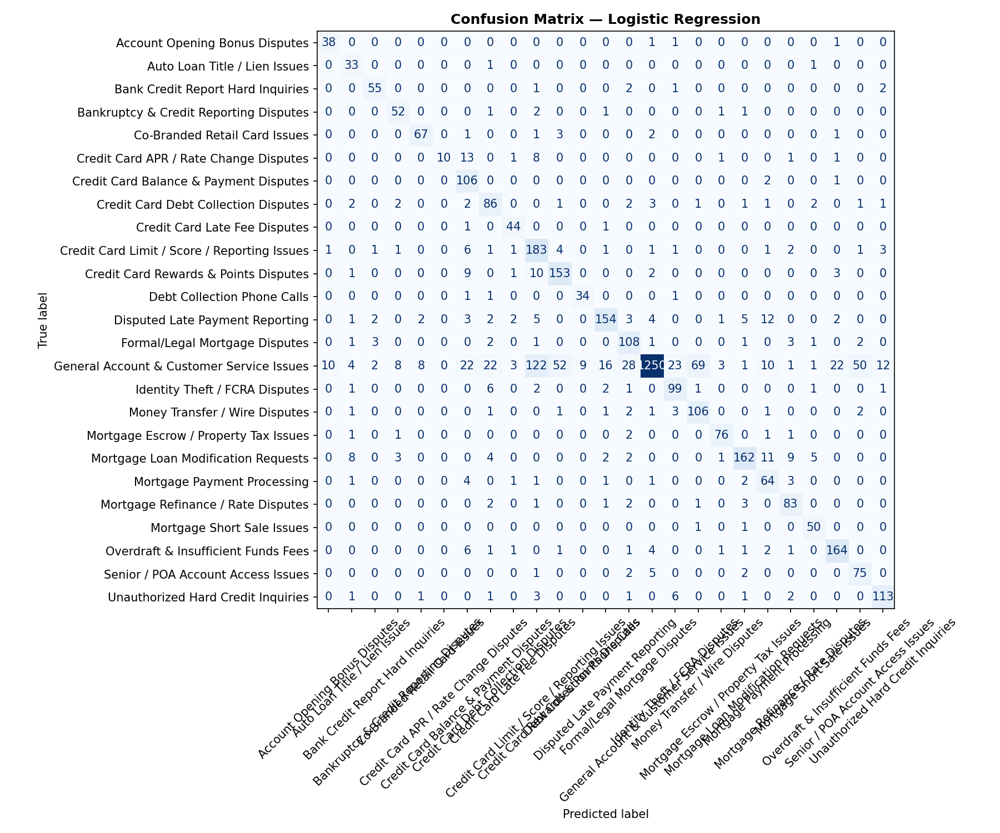
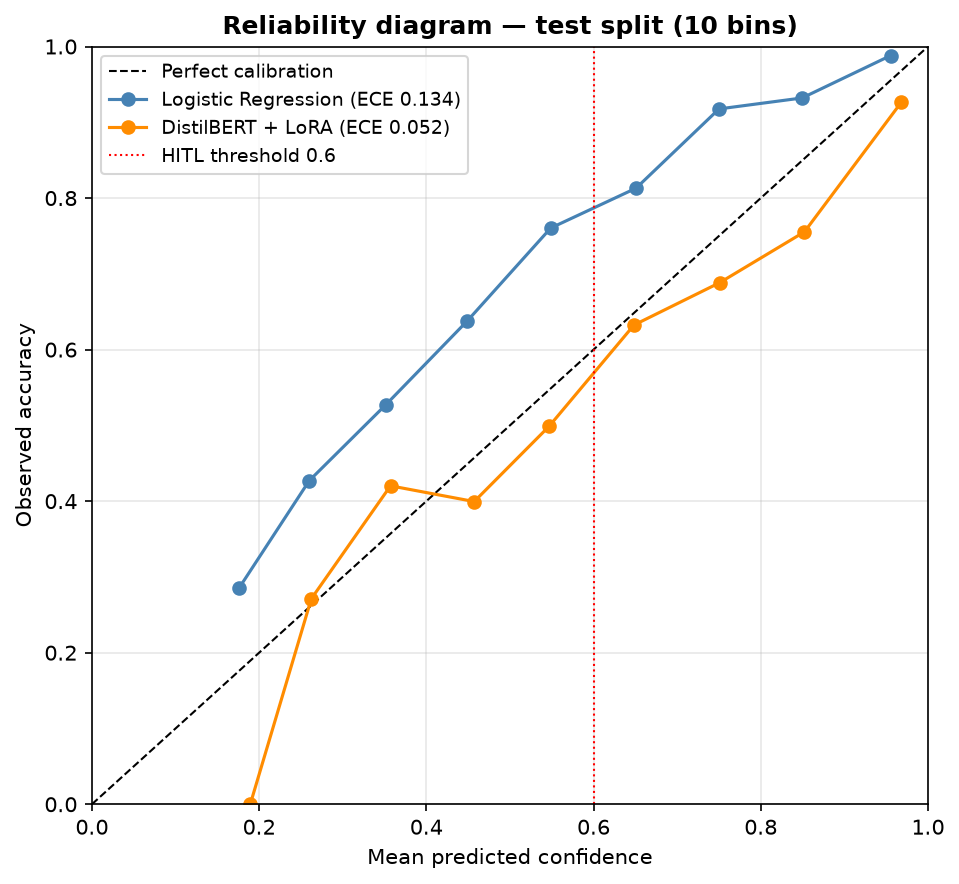

# Financial Complaints Analyzer

Banks receive complaints as free text. Someone has to read each one, work out what it is about, judge how urgent it is, and route it to the right team. This project does that first pass automatically — and, more importantly, knows when to stop and ask a human.

It runs end to end on 21,000 real complaints from the U.S. Consumer Financial Protection Bureau.

---

## What it does

It comes in two notebooks that do deliberately different jobs: **Part 1 is a playground for the modelling questions, Part 2 is the system those answers produce.**

**Part 1 — find the topics, then learn them.** Nobody labelled this data, so the project discovers its own categories: it embeds every complaint, clusters them, and turns the clusters into a 25-topic taxonomy (overdraft fees, escrow disputes, identity theft, and so on). Those topics then become training labels for a classifier that can tag a brand-new complaint in milliseconds. Every hyperparameter is exposed in one config cell so you can re-run it with your own choices and see what changes.

**Part 2 — triage it.** An agent takes an incoming complaint and runs five steps: classify the topic, judge urgency, retrieve similar past cases, draft an internal case note grounded in those cases, and decide whether a human needs to see it before anything happens. This is the real-world end of it — the operational consequence of whatever Part 1 concluded.

```
complaint → classify → urgency → find similar cases → draft note → review gate
                                                                      ├→ human review
                                                                      └→ auto-route to team
```

Everything expensive is avoided where a cheap check will do. The classifier is local, so topic tagging costs nothing. Urgency is decided by regex first — a complaint mentioning a lawyer, fraud, foreclosure or bankruptcy is HIGH immediately, no LLM call. Gemini is only asked about the genuinely ambiguous middle, and to write the case note.

---

## Results

Two classifiers were trained on identical splits and compared on held-out data (n = 4,200):

| Model | Macro F1 | Accuracy | Sent to a human |
|---|---:|---:|---:|
| **Logistic Regression** (shipped) | **0.79** | 0.80 | 40.4 % |
| DistilBERT + LoRA | 0.71 | 0.72 | 25.2 % |

The simpler model won by 8 macro-F1 points. It sees more than the transformer does: TF-IDF over the full text, sentence embeddings over the full text, plus product and channel metadata. LoRA only sees raw text truncated to 256 tokens, and 44 % of these complaints are longer than that — the model never reads 40 % of this corpus.



---

## When does it ask a human?

Three independent triggers send a case to a person: confidence below 0.60, urgency HIGH, or no similar past case found. Any one of them is enough.

Logistic regression trips the confidence trigger far more often than LoRA — 40.4 % against 25.2 %. A higher review rate looks like the worse number. It isn't, and the reason is not the one you would expect.



**LoRA is the better-calibrated model** by the usual measure (ECE 0.052 vs 0.134). What matters for triage is not the size of the miscalibration but its *direction*.

Logistic regression sits **above** the diagonal everywhere — it is under-confident. When it says 55 % sure, it is right 76 % of the time. It sends people work it would often have got right: wasteful, but safe.

LoRA sits **below** the line exactly where it hurts. It marks 39 % of cases above 0.9 confidence and is right 92.6 % of the time there; in the 0.8–0.9 band it claims 85 % and delivers 76 %. Those are the cases it auto-routes without anyone looking.

An under-confident model costs review hours. An over-confident one quietly sends wrong answers onward. For a complaints queue, the first failure is the one you want — which is why the model with the worse ECE is the one that shipped.

<a id="threshold-tradeoff"></a>

### The threshold is a dial

The confidence trigger fires below 0.60. Moving it trades review load against risk:

| Threshold | Logistic Regression | DistilBERT + LoRA |
|---:|---:|---:|
| 0.50 | 28.4 % | 14.7 % |
| **0.60** (shipped) | **40.4 %** | 25.2 % |
| 0.70 | 51.8 % | 35.6 % |
| 0.80 | 64.2 % | 45.9 % |

---

## The two notebooks

They are meant to be read as a pair, and they do different jobs.

### [`complaint_analysis.ipynb`](complaint_analysis.ipynb) — Part 1, the playground

**This one is built to be taken apart.** It is where the modelling questions get asked, and it is set up so anyone can come along and ask them differently. Every knob sits in a single config cell at the top — the embedding model, the HDBSCAN cluster size, the topic count, the TF-IDF budget, the LoRA rank and alpha, the token cap, the confidence threshold. Change one, run all, read the comparison at the bottom.

Covers EDA, preprocessing, sentence embeddings, the BERTopic taxonomy, both classifiers, and then the evidence: side-by-side comparison, calibration, and the truncation control.

Some things worth trying if you clone it:

- Raise `MAX_LENGTH` to 512 and see how much of the LoRA gap closes.
- Swap `all-MiniLM-L6-v2` for a larger encoder.
- Move `HDBSCAN_MIN_CLUSTER_SIZE` and watch the taxonomy coarsen or fragment.
- Prepend the product and channel as text so the transformer gets the metadata too.
- Set `CLASSIFIER_TO_USE = 'lora'` and re-run Part 2 against it.

### [`complaint_agent.ipynb`](complaint_agent.ipynb) — Part 2, the use case

**This one is what the experiment was for.** Part 1 compares models and picks one; Part 2 takes that winner and runs the system an operations team would actually sit in front of. A complaint comes in, and the agent classifies it, judges urgency, retrieves precedent, drafts an internal case note and decides whether a person sees it before anything moves.

It does not re-open the modelling questions. It reads the artefacts Part 1 saved and treats them as settled — which is the point. Change the classifier upstream, re-run this, and the whole operational picture moves with it: different confidence distribution, different review load, different cases reaching a human.

Covers the ChromaDB vector store, the LangGraph agent, a demo on held-out complaints, and a daily-briefing batch function.

Part 2 reads artefacts that Part 1 produces, so run Part 1 first.

### Design choices worth knowing

- **BERTopic** with `all-MiniLM-L6-v2` embeddings, UMAP → HDBSCAN clustering, and bigram/trigram c-TF-IDF for keywords. Outlier reduction reassigns the HDBSCAN noise group so every complaint ends up with a topic.
- **Hybrid features** for the classifier: TF-IDF + sentence embeddings + metadata one-hots. `issue` and `sub_issue` are deliberately excluded — they overlap with the BERTopic labels and would leak.
- **Retrieval is honest.** ChromaDB indexes only the train and validation splits. The demo complaints come from the test split, so they are unseen by both the classifier and the vector store.
- **The LLM is never the source of facts.** Topic, confidence, urgency and precedents are all decided before the prompt is built; Gemini writes prose around them.

---

## Data

The **CFPB Consumer Complaint Database**, published by the U.S. Consumer Financial Protection Bureau: [consumerfinance.gov/data-research/consumer-complaints](https://www.consumerfinance.gov/data-research/consumer-complaints/)

Save the export as `data/complaints_flat.csv`. The full file is ~46 MB and 78,313 rows, and is not in git. Only about 27 % of records include a narrative — those ~21,000 rows are what everything downstream runs on.

A 2,000-row sample is committed at [`data/sample_complaints.csv`](data/sample_complaints.csv) so you can see the column layout without downloading anything. It is a format reference, far too small to reproduce the taxonomy.

---

## Setup

```powershell
# Windows (PowerShell)
python -m venv .venv
.\.venv\Scripts\Activate.ps1
pip install -r requirements.txt
```

```bash
# macOS / Linux
python -m venv .venv
source .venv/bin/activate
pip install -r requirements.txt
```

PyTorch installs separately:

```bash
pip install torch torchvision torchaudio --index-url https://download.pytorch.org/whl/cu118
```

That wheel is for NVIDIA GPUs. Without one, install the CPU build — everything up to and including Logistic Regression runs fine on CPU. The LoRA fine-tune runs there too, roughly 4–6× slower; skip it and the comparison and calibration cells have no LoRA results to plot.

Part 2 needs a free Gemini API key — copy `.env.example` to `.env` and add one from [aistudio.google.com](https://aistudio.google.com/app/apikey). Part 1 does not need it.

To register the venv as a Jupyter kernel:

```bash
python -m ipykernel install --user --name=fca-venv --display-name "Python (FCA venv)"
```

`outputs/` holds the BERTopic model, classifier pickles, the LoRA adapter, the demo set and the plots. The large rebuildable files (`chroma_db/`, `lora_checkpoints/`, `df_clf.parquet`, `embeddings.npy`) are not in git — Part 1 regenerates them, and Part 2 cannot run until it has.

---

## Limitations

- **The labels are machine-made.** Topics come from BERTopic clusters, not human annotation, so 0.79 macro-F1 measures agreement with a clustering — not with ground truth. A real deployment would need people to validate the taxonomy first.
- **Confidence scores are not probabilities.** The shipped classifier is under-confident (ECE 0.134, accuracy above stated confidence in every bin), most likely from `class_weight='balanced'`. The bias is in the safe direction, but don't read the numbers as calibrated risk.
- **The review rate is a choice, not a property.** 40.4 % follows from the 0.60 threshold — see [the dial above](#threshold-tradeoff).
- **Nothing is sent to a customer.** The agent drafts internal case notes for a human to approve. It is a triage assistant, not an autoresponder.

---

## License

MIT — see [LICENSE](LICENSE).
